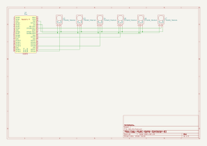
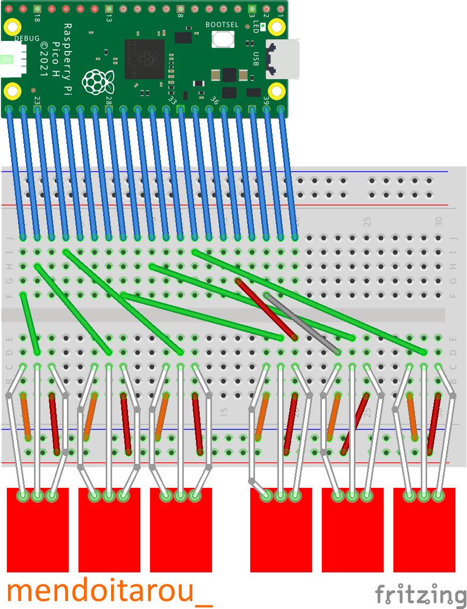

# Easy_Music_Game_Controller

An English version is currently being prepared.

Please wait for a while.

# はじめに
これは原神やヘブンバーンズレッドの音ゲーをPCでも安価で快適にプレイするためのツールです。

オープンソースで配布しますので、だれでも自由に作成可能です。

(実際に試作してみましたが.....微妙です...)

# 作り方
## 必要なもの
リスト(気軽に作りたい人向け)
- データ通信が可能なUSBケーブル(1個)(Raspberry Pi Picoに合ったコネクタ形状を選択してください。)
- Raspberry Pi Pico H(1個)
- タッチセンサー(6個)(動作確認: TTP223)
- ピンヘッダ(ピンピッチが2.54 mmのもの。)(3ピンが6個。)
- ブレッドボード(1個。余裕が欲しい方は2個)
- ジャンプワイヤ(20本ぐらい必要。大体セットでたくさん入っている物が売られています。)

まずは、Raspberry Pi Picoを購入します。

はんだ付けに自信がない方はピンヘッダがすでにはんだ付けされたRaspberry Pi Pico Hの購入をお勧めします。

購入リンク(Switch Science):
- [Raspberry Pi Pico](https://ssci.to/6900)
- [Raspberry Pi Pico H](https://ssci.to/8170)

次にタッチセンサーを購入します。動作確認をしたのはTTP223というモジュールです。

[購入リンク(Amazon.co.jp)](https://amzn.asia/d/cPFWkBX)
※アフィリエイトリンクではありません。

さらに、ピンヘッダも購入します。ピンピッチが2.54 mmのものならお好きなものをどうぞ。

気軽に作りたい方はブレッドボードも購入します。

(ちゃんと作りたい方は、「基盤発注」まで読み飛ばしてください。)

## はんだ付け
Raspberry Pi Picoを購入した方は、Raspberry Pi Picoとタッチセンサーにピンヘッダをはんだ付けをします。

Raspberry Pi Pico Hを購入した方は、タッチセンサーだけピンヘッダをはんだ付けをします。

## 配線
次の回路図を見て配線してください。

(といっても回路図が汚くて見づらいのでわからんという方は下の図は飛ばしてください。)

(下はブレッドボードでの配線図です。伝わってほしい。)

上の配線図ではわかりずらいので実物の画像も載せておきます。

配置前

配置後

なお、Raspberry Pi Picoのピンアサインはこちらを参照してください。

(引用元: [Raspberry Pi Documentation - Raspberry Pi Pico and Pico W](https://www.raspberrypi.com/documentation/microcontrollers/raspberry-pi-pico.html))

## Raspberry Pi Picoのセットアップ

### ファームウェア&プログラムのダウンロード
まずは、CircuitPythonをダウンロードします。

[CircuitPythonの公式ページ](https://circuitpython.org/board/raspberry_pi_pico/)からファームウェアをダウンロードします。

ファイル名は``adafruit-circuitpython-raspberry_pi_pico-ja-x.x.x.uf2``のようになっているはずです。(``x.x.x``はバージョンです。)

次に、KMK Firmwareをダウンロードします。

[公式Github Repository](https://github.com/KMKfw/kmk_firmware/archive/refs/heads/master.zip)からダウンロードします。

ファイル名は``kmk_firmware-master.zip``になっているはずです。

ダウンロードしたら、zipファイルを解凍してどこかに保管しておきます。

次に、このリポジトリの``program``ディレクトリの中にある``main.py``をダウンロードし、どこかに保管しておきます。

### ファームウェア&プログラムの書き込み
ここまで出来たら、Raspberry Pi Picoの``BOOTSEL``ボタンを押しながらPCにUSBケーブルで接続します。

(上の図にもボタンが描かれています。)

すると、``RPI-RP2``というドライブが認識されるので、ボタンから手を放します。

次に``RPI-RP2``ドライブに先ほどダウンロードした``adafruit-circuitpython-raspberry_pi_pico-ja-x.x.x.uf2``をコピー&ペーストします。

すると、ドライブの接続が解除され、``CIRCUITPY``というドライブが認識されます。

次に、先ほど解凍した``kmk_firmware-master.zip``の中身のうち``KMK``というディレクトリと``boot.py``というファイルを``CIRCUITPY``にコピー&ペーストします。

最後に、先ほどダウンロードした``main.py``を``CIRCUITPY``にコピー&ペーストします。

## 動作確認
これで完成です！

メモ帳を開き、タッチセンサーを押してみましょう！

左からA,S,D,J,K,Lが入力されるはずです！

# 上級者向け(ちゃんと作りたい方向け)
ブレッドボードではなく、基盤を発注しケースに収めて完成！というガイドです。

(現在作成中です。)

# 使用したもの

[KiCad](https://www.kicad.org/)

KiCad Raspberry Pi Pico Library ([Datasheets RaspberryPi RP2040](https://datasheets.raspberrypi.com/rp2040/hardware-design-with-rp2040.pdf))

KiCad TTP223 Touch 1 Module Library ([RoboUlbricht/kicad.lib - Github](https://github.com/RoboUlbricht/kicad.lib))

[fritzing](https://fritzing.org/)

fritzing Raspberry Pi Pico Parts ([Documentation RaspberryPi Pico](https://www.raspberrypi.com/documentation/microcontrollers/raspberry-pi-pico.html))
